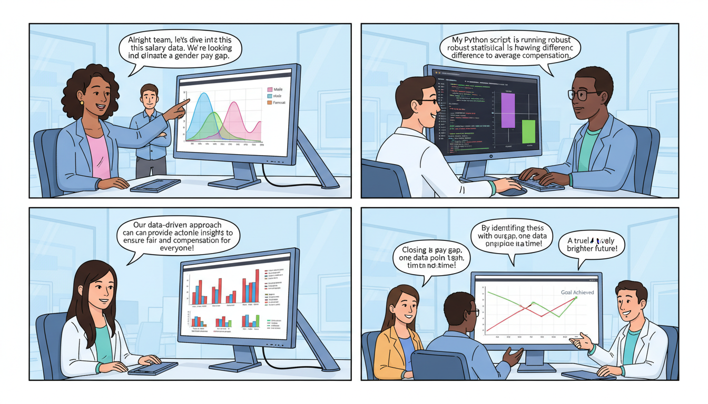

Based on the repository name and file contents, this project is a data science exploration of gender-based salary structures. Below is a professional and comprehensive `README.md` file tailored for this repository.

---

# Gender Salary Structure Analysis (`estructura_salarial_genero`)

[](https://www.python.org/)
[](https://opensource.org/licenses/MIT)

## 📌 Overview

This repository contains a comprehensive data analysis project focused on investigating the **gender pay gap** and salary distribution structures. The project utilizes Python to process workforce data, perform exploratory data analysis (EDA), and visualize disparities in earnings between different gender groups.

The goal is to provide a clear, data-driven perspective on how variables such as experience, education, and role type interact with gender to influence compensation.

## 🗂️ Project Structure

The repository consists of two main execution files:

*   **`estruc_sal.ipynb`**: A Jupyter Notebook containing the step-by-step analysis, detailed visualizations (Matplotlib/Seaborn), and narrative interpretations of the data.
*   **`estruc_sal.py`**: A production-ready Python script version of the analysis, suitable for automated reporting or integration into larger pipelines.

## 🚀 Key Features

*   **Data Cleaning:** Handling missing values and normalizing salary units.
*   **Descriptive Statistics:** Calculation of mean, median, and standard deviation of salaries segmented by gender.
*   **Data Visualization:**
    *   Distribution plots (Histograms/KDE) to visualize salary density.
    *   Box plots to identify outliers and quartiles.
    *   Heatmaps for correlation between experience and income.
*   **Gap Analysis:** Calculation of the percentage difference in earnings and statistical significance testing.

## 🛠️ Installation & Setup

1.  **Clone the repository:**
    ```bash
    git clone https://github.com/your-username/data_analysis-estructura_salarial_genero.git
    cd data_analysis-estructura_salarial_genero
    ```

2.  **Create a virtual environment (optional but recommended):**
    ```bash
    python -m venv venv
    source venv/bin/activate  # On Windows: venv\Scripts\activate
    ```

3.  **Install dependencies:**
    Ensure you have `pandas`, `numpy`, `matplotlib`, and `seaborn` installed:
    ```bash
    pip install pandas numpy matplotlib seaborn jupyter
    ```

## 💻 Usage Examples

### Running the Python Script
To generate a quick summary report via the terminal:
```bash
python estruc_sal.py
```

### Exploring with Jupyter Notebook
To view the interactive visualizations and detailed step-by-step logic:
```bash
jupyter notebook estruc_sal.ipynb
```

### Sample Code Snippet
The analysis typically follows this logic:
```python
import pandas as pd
import seaborn as sns
import matplotlib.pyplot as plt

# Load dataset
df = pd.read_csv('salary_data.csv')

# Calculate the Gender Pay Gap
mean_salary = df.groupby('gender')['salary'].mean()
gap = (mean_salary['Male'] - mean_salary['Female']) / mean_salary['Male'] * 100

print(f"Observed Gender Pay Gap: {gap:.2f}%")

# Visualize the distribution
sns.boxplot(x='gender', y='salary', data=df, palette="Set2")
plt.title('Salary Distribution by Gender')
plt.show()
```

## 📊 Expected Insights
*   **Distribution Skewness:** Analysis of whether one gender is disproportionately represented in high-income brackets ("The Glass Ceiling").
*   **Experience Correlation:** Determining if the pay gap widens or narrows as years of experience increase.
*   **Categorical Impact:** Identifying specific sectors or roles where the wage disparity is most prevalent.

## 📝 License

This project is licensed under the MIT License - see the [LICENSE](LICENSE) file for details.

## 🤝 Contributing

Contributions are welcome! If you have suggestions for improving the statistical models or adding new visualizations:
1. Fork the Project.
2. Create your Feature Branch (`git checkout -b feature/NewAnalysis`).
3. Commit your Changes (`git commit -m 'Add some NewAnalysis'`).
4. Push to the Branch (`git push origin feature/NewAnalysis`).
5. Open a Pull Request.

---
**Contact:** [Your Name/Email or GitHub Profile]  
**Project Link:** [https://github.com/your-username/data_analysis-estructura_salarial_genero](https://github.com/your-username/data_analysis-estructura_salarial_genero)